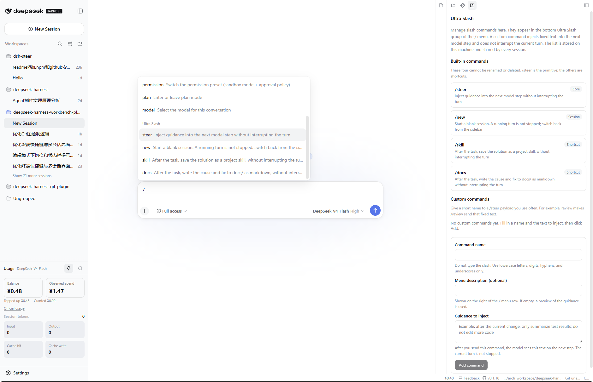

A workbench plugin for the [DeepSeek Harness](https://github.com/deepseek-ai/deepseek-harness) Web UI. After Workbench is opened in Conversation, chat stays on the left. Two columns appear on the right: the editor (syntax highlighting and terminal) and the side dock for files, Git, the **Usage** panel, and the **Ultra Slash** panel.

The two panels to look for first:

- **Usage** — official API balance, this-machine observed spend, this-session tokens and context. Pin it above the left **Settings** button so you can see spend while chatting.
- **Ultra Slash** — slash commands that inject guidance **without stopping the current turn**. Manage them in the right dock; send them from the bottom group of the chat `/` menu.

## Contents

- [Interface](#interface)
- [Core capabilities](#core-capabilities)
- [Feature list](#feature-list)
- [Usage panel](#usage-panel)
- [Ultra Slash](#ultra-slash)
- [Capability matrix](#capability-matrix)
- [Release](#release)
- [Installation](#installation)
- [Upgrade](#upgrade)
- [Workspace terminal](#workspace-terminal)
- [AI command assist](#ai-command-assist)
- [License](#license)

## Interface

The workbench uses a three-column layout. Conversation stays on the left. The two columns on the right are the capability area: editor and terminal in the center; file tree, Git, Usage, and Ultra Slash on the far right. The right dock tabs are **Files**, **Source Control**, **Usage**, and **Ultra Slash**.





## Core capabilities

1. **Workbench layout.** Three columns: Conversation on the left, editor and terminal in the center, files / Git / Usage / Ultra Slash on the right. A new session opens the workbench immediately. By default the editor is collapsed, the files sidebar is open, and usage is pinned above Settings. Columns can be resized, collapsed to icon rails, and restored. Collapse, the side-dock tab, and the usage pin are remembered globally across reload and new sessions.
2. **Smart terminal.** A local PTY. Real shell lines (including pasted `$ ls`) go straight to the terminal; natural language is translated and typed into the **current** shell. Notes are non-executable. A configurable blacklist blocks destructive commands the assistant would otherwise type.
3. **Workspace editor.** CodeMirror 6 with syntax highlighting, Plain / Emacs / Vim keymaps, Markdown edit / preview / split, image and spreadsheet previews, Git diffs, tabs, breadcrumbs, save and dirty-close guards.
4. **Files.** Tree browse, filter, hidden files, `.gitignore` marks, new / rename / delete, and open in a local editor (Cursor, VS Code, and others).
5. **Git.** Status, stage, commit (including streamed AI messages), fetch / pull / push with safety checks, branches, merge, restore, commit graph, `git init`, and model-facing `git_*` tools.
6. **Usage panel.** Official API balance, this-machine observed spend, this-session tokens and context. Open the right-dock **Usage** tab, or pin the panel above the left **Settings** button (including the collapsed icon rail). The status bar always shows the balance next to **Feedback**.
7. **Ultra Slash panel.** Slash commands that inject guidance into the next model step **without interrupting the current turn**. Open the right-dock **Ultra Slash** tab to manage them; type `/` in chat and pick from the bottom Ultra Slash group. Built-in: `/steer`, `/new`, `/skill`, `/docs`. Custom `/name` shortcuts are stored on this machine and shared by every session.
8. **Status bar.** Open-file tabs, balance, Feedback, version / upgrade, workspace path, branch, dirty count, editor mode.
9. **Maintenance & privacy.** In-UI upgrade checker, Chinese / English UI, and redaction of tokens in paths and errors.

## Feature list

### Workbench

- Three-column layout: Conversation | editor + terminal | files / Git / Usage / Ultra Slash
- Right-dock tabs: **Files**, **Source Control**, **Usage**, **Ultra Slash**
- Opens as soon as you create a session; no first message required
- Header **Workbench** button shows or hides the whole workbench
- Drag column widths; double-click a sash to reset; widths are remembered
- Collapse Conversation, editor, or the right dock into a narrow icon rail

### Editor

- Multi-file tabs; save; unsaved indicator; confirm before closing dirty files
- Close all / others / left / right
- Path breadcrumbs
- Syntax highlighting: JavaScript, TypeScript, JSX, TSX, JSON, HTML, CSS, Markdown, Python, XML, YAML; other files stay plain text
- Keymaps: Plain / Emacs / Vim from the status bar; the choice persists; **Emacs is the default** so typing is insertion, not Vim normal mode
- Markdown: edit, preview, or split; GFM; http(s) and workspace-relative images; [Mermaid](https://mermaid.js.org/) 11 fenced blocks; workspace file links open in the editor; unsafe links are blocked
- Git working-tree diffs and commit diffs open as editor tabs
- Image preview: png, jpg, jpeg, gif, webp, avif, bmp, ico
- Table preview: csv, tsv, xlsx (UTF-8, then GB18030 if the file looks garbled). `.xls` is recognized but opens in an external app
- New empty file; new terminal tab (<kbd>Alt</kbd>+<kbd>J</kbd>)

### File tree

- Browse, expand, open, new, rename, delete (with confirmation)
- Toggle hidden files; `.gitignore` ignored files are marked
- Filter by file name
- Open a file or the whole workspace in Cursor, VS Code, VS Code Insiders, VSCodium, Windsurf, Zed, or the system default (only apps that are actually installed)
- Truncation notice when a folder is too large to list in full

### Git

- `git init` plus `user.name` / `user.email` when the folder is not a repo
- Staged / unstaged / untracked lists
- Stage, unstage, and whole-section actions
- Discard unstaged edits or delete untracked files (with confirmation)
- Open a file diff in the editor
- Commit, commit all, <kbd>Ctrl</kbd>+<kbd>Enter</kbd>
- Streamed AI commit messages; customizable template
- Fetch / pull / push. Dirty tree, behind remote, detached HEAD, and missing upstream block the unsafe click. No `--force`
- Pull mode: merge / fast-forward only / rebase. Push mode: normal / force-with-lease
- Switch branch, create and switch, merge (conflicts abort cleanly)
- Ahead / behind counts and remote probe
- GRAPH: commit graph, compact by default (message-only; can switch to full), copy hash, expand files, open a commit diff, drag height; compact/open and Git settings are remembered
- Conversation tools: `git_status`, `git_diff`, `git_log`, `git_branch`, `git_commit` (commit needs user approval; no delete / `reset --hard` / `clean`)

### Usage

- Right-dock **Usage** tab (gauge icon). Pin it above left **Settings** so you can watch spend while chatting
- Official API balance; currency mark follows the API (`¥` for CNY, `$` for USD)
- Observed spend on this machine (top-ups do not erase it). The official key API does not return lifetime spend — this is a local running total, not the website figure
- Session tokens: input / output / cache hit / cache write / hit rate (this conversation only)
- Context occupancy
- **Official usage** opens the DeepSeek usage page
- Unpin to send the panel back to the right dock. Pin still works when the left rail is collapsed (compact strip: balance / spend / tokens)
- Drag height without covering the session list; double-click the handle to reset
- Status-bar balance to the left of **Feedback**; `—` (or `¥—` / `$—`) when the balance cannot be read
- See [Usage panel](#usage-panel) for where to click and what the numbers mean

### Ultra Slash panel

- Right-dock **Ultra Slash** tab (`/` icon). Chinese UI label: **插件命令**
- Type `/` in the chat box: plugin commands sit in the **bottom** group, below a divider
- Built-in, cannot be renamed or deleted: `/steer` (inject guidance), `/new` (blank session), `/skill` (save a project skill after the task), `/docs` (write cause and fix under `docs/` after the task)
- Custom `/name` shortcuts send a fixed `/steer` payload. Fill `review` in the panel — do not type the slash — and `/review` appears in the menu
- **Does not interrupt** the current turn. If the model is running, the text is queued for the next model access; you do not need **Stop**
- Stored on this machine at `~/.dsh/ultra-slash/commands.json`; every session shares the same list (at most 40 custom commands)
- See [Ultra Slash](#ultra-slash) for the command table and how to add your own

### Status bar

- Scrollable open-file tabs
- Balance, Feedback (GitHub Issues), version (GitHub repo), upgrade entry (npm)
- Workspace path (tokens redacted), current branch, dirty file count
- Editor-mode menu

### Smart terminal

- Local xterm.js PTY in the workspace directory
- Command vs. natural-language classification; pasted prompt prefixes such as `$ ls` still count as commands
- Multiple tabs (<kbd>Alt</kbd>+<kbd>J</kbd>); each tab has its own PTY and AI-assist state; the first terminal tab stays pinned
- AI command assist (<kbd>Alt</kbd>+<kbd>I</kbd> or the sparkle button)
- Notes / greetings / warnings written as non-executable statements
- Configurable destructive blacklist (assistant-typed only; what you type in the PTY is not blocked)
- Assist settings: separator line, one-line explanation, direct-run of real commands, custom translation prompt
- Interrupt (<kbd>Ctrl</kbd>+<kbd>C</kbd>), reconnect, copy output
- POSIX shells: bash / zsh / sh / dash. Windows: Git Bash, then Windows PowerShell. See [Workspace terminal](#workspace-terminal)

### Maintenance

- Chinese and English UI
- Dismissible upgrade notice; install command pasted into the terminal as a `#` comment
- Tokens, passwords, and Bearer keys are redacted in UI text and errors; URLs keep host and path

## Usage panel

Open the right-dock **Usage** tab (gauge icon). To keep spend in view while you chat, click the pin: the panel moves above the left **Settings** button. Click pin again to send it back to the right dock. Pin still works when the left rail is collapsed — you get a compact strip with balance, spend, and tokens.

| What you see | Meaning |
| --- | --- |
| Balance | Official API balance. Currency follows the API (`¥` for CNY, `$` for USD) |
| Observed spend | Sum of balance **drops** recorded on this machine after you started watching. Top-ups do not erase it. This is **not** the lifetime total on the official website — the key API does not return that figure |
| Session tokens | Input / output / cache hit / cache write / hit rate for **this conversation only**, not the whole account |
| Context | How much of the current context window is used |
| Official usage | Opens [platform.deepseek.com/usage](https://platform.deepseek.com/usage) |

Drag the top handle to change height; double-click resets. The session list above stays visible. The status bar (left of **Feedback**) always shows the same balance; `—` means it could not be read.

If the panel cannot load a balance:

- **No API key** — fill the key environment variable in Settings
- **Key rejected** — check for typos or extra spaces
- **Endpoint failed** — click Refresh; this also happens when the network or provider is down
- **Unsupported** — this provider has no usable balance API

**Reset observed spend** only clears the local running total on this machine. It does not change the official account.

## Ultra Slash

Open the right-dock **Ultra Slash** tab (`/` icon; Chinese UI: **插件命令**). These commands also appear when you type `/` in the chat box: they sit in the **bottom** group, below a divider, titled Ultra Slash.

They inject text into the **next** model step. The current turn is **not** stopped. You do not need **Stop**. If the model is running, the text is queued until the next model access; if it is idle, the next step starts immediately.

### Built-in commands

These four cannot be renamed or deleted.

| Command | What it does |
| --- | --- |
| `/steer <guidance>` | Inject the guidance into the next model step without interrupting the turn. Example: `/steer list the files you would change, do not edit yet` |
| `/new` | Switch to a blank session. A running turn is not stopped; switch back from the left session list |
| `/skill` | After the current task, save the solution as a skill in this project. Same “do not interrupt” rule as `/steer` |
| `/docs` | After the current task, write the cause and the fix as markdown under `docs/`. Same rule as `/steer` |

If `/steer` is sent with empty text, the UI tells you to write the guidance first and shows a usage example. Nothing is injected.

### Custom commands

Give a short name to a `/steer` payload you use often. For example, fill `review` and a fixed paragraph; afterwards `/review` in chat sends that paragraph.

1. Open the right-dock **Ultra Slash** tab.
2. Under **Custom commands**, fill **Command name** (no slash: `review` becomes `/review`), optional **Menu description**, and **Guidance to inject**.
3. Click **Add command**. A success line confirms the name; you can type it in chat immediately.
4. Edit or delete a row from the same list. Delete asks for confirmation.

Rules the panel enforces (you will see a Chinese or English reason under the field if something is wrong):

- Name: start with a lowercase letter; then only letters, digits, hyphens, or underscores. Put Chinese or other languages in the guidance text, not the name.
- Do not reuse `/steer`, `/new`, `/skill`, `/docs`, or DeepSeek Harness names such as `/help` and `/plan`.
- At most 40 custom commands. Description at most 80 characters; guidance at most 8000.
- The list is stored on this machine at `~/.dsh/ultra-slash/commands.json` (or `$DSH_HOME/ultra-slash/commands.json`) and is shared by every session. A damaged file is not overwritten — fix or delete it, then try again.

## Capability matrix

| Area | Capability | Notes | Status |
| --- | --- | --- | --- |
| Workbench | Three-column layout | Chat \| editor + terminal \| files / Git / Usage / Ultra Slash | Supported |
| Workbench | Auto-open | New session opens the workbench without a first message | Supported |
| Workbench | Resize / collapse | Drag sashes (double-click resets); collapse to icon rails; widths remembered | Supported |
| Editor | Syntax highlighting | JS / TS / JSX / TSX / JSON / HTML / CSS / Markdown / Python / XML / YAML | Supported |
| Editor | Keymaps | Plain / Emacs / Vim; persists; Emacs default | Supported |
| Editor | Tabs and save | Multi-tab, dirty close confirm, close all / others / left / right | Supported |
| Editor | Markdown | Edit / preview / split; images; Mermaid; safe file links | Supported |
| Editor | Image preview | png / jpg / jpeg / gif / webp / avif / bmp / ico | Supported |
| Editor | Table preview | csv / tsv / xlsx; `.xls` external only | Supported |
| Editor | Diffs | Working-tree and commit diffs as tabs | Supported |
| Files | File tree | Browse / filter / hidden / ignore marks / new / rename / delete | Supported |
| Files | Open externally | Cursor / VS Code / Insiders / VSCodium / Windsurf / Zed / system default | Supported |
| Git | Status and commit | Stage / restore / commit / AI message / template | Supported |
| Git | Sync | Fetch / pull / push with dirty / behind / detached guards; no `--force` | Supported |
| Git | Branches | Switch / create / merge; `git init` + identity | Supported |
| Git | GRAPH | Commit graph, compact mode, copy hash, commit file diffs | Supported |
| Git | Model tools | `git_status` / `git_diff` / `git_log` / `git_branch` / `git_commit` | Supported |
| Usage | Balance and tokens | Official balance; local observed spend; this-session tokens; context | Supported |
| Usage | Pin | Above left Settings, including collapsed rail; status-bar ¥ / $ | Supported |
| Ultra Slash | Built-in commands | `/steer` / `/new` / `/skill` / `/docs`; do not interrupt the current turn | Supported |
| Ultra Slash | `/` menu group | Bottom Ultra Slash group (Chinese: 插件命令), below a divider | Supported |
| Ultra Slash | Custom commands | Named `/steer` shortcuts; local `commands.json`; at most 40 | Supported |
| Status bar | Chrome | File tabs, Feedback, version, cwd, branch, dirty, editor mode | Supported |
| Smart terminal | Local PTY | xterm.js; POSIX bash / zsh / sh / dash with path constraints | Supported |
| Smart terminal | Command vs. natural language | Real argv lines go to the PTY; requests are translated | Supported |
| Smart terminal | Multiple terminal tabs | <kbd>Alt</kbd>+<kbd>J</kbd>; isolated PTY per tab | Supported |
| Smart terminal | AI translation | <kbd>Alt</kbd>+<kbd>I</kbd>; current session shell only | Supported |
| Smart terminal | Note isolation | Greetings / warnings never executed | Supported |
| Smart terminal | Destructive blacklist | Assistant-typed only; rules configurable | Supported |
| Smart terminal | Windows — Git Bash | Standard Git for Windows paths | Supported |
| Smart terminal | Windows — PowerShell | System PowerShell when Git Bash is absent | Supported |
| Maintenance | Upgrade checker | Notice + `#` install command in the terminal | Supported |
| Maintenance | Locales | Chinese and English | Supported |
| Privacy | Secret redaction | Tokens in UI / errors / paths | Supported |
| Compatibility | Shells beyond tested coverage | fish / tcsh / csh / ksh / mksh / cmd / BusyBox-as-`ash`; `$SHELL` is ignored and a tested shell is used when available | Not yet covered by tests |
| Compatibility | Remote SSH jump-host sessions | Not yet covered by tests | Not yet covered by tests |

## Release

| Item | Description |
| --- | --- |
| Package | [`dsh-workbench-plugin`](https://www.npmjs.com/package/dsh-workbench-plugin) |
| Version | **0.1.19** (npm tag `latest`) |
| Registry | https://registry.npmjs.org |

```
+ dsh-workbench-plugin@0.1.19
```

Maintainers publish npm with `bash devops/release.sh`. The script uses the existing `npm login` session on this machine. Credentials must not be stored in the repository.

The app market installs from GitHub (`github:loadingvx/deepseek-harness-workbench-plugin`). That path does **not** compile on the user's machine. Before every GitHub push: `bash devops/build.sh`, then commit `lib/index.js` and `lib/client.js` together with the source.

## Installation

### Prerequisites

[DeepSeek Harness](https://github.com/deepseek-ai/deepseek-harness) is installed, and `dsh web` can be started.

### Procedure

1. Install the plugin (pin the version; do not omit `@0.1.19`):

```bash
dsh plugin --profile web add dsh-workbench-plugin@0.1.19
```

`dsh plugin add` is implemented with pnpm. pnpm 11 waits **24 hours** after a version is published before it will pick it as `latest`. A bare `dsh-workbench-plugin` (no `@version`) can therefore install **0.1.0** and still exit 0. Pinning `@0.1.19` requests that release explicitly.

If a pinned install is still refused as too new, add this to `~/.dsh/profiles/web/pnpm-workspace.yaml` and run the command again:

```yaml
minimumReleaseAgeExclude:
  - dsh-workbench-plugin
```

2. Restart `dsh web`.
3. Open http://127.0.0.1:3080, enter **Conversation**, and create a new session. Workbench opens on the right immediately — you do not need to send a first message. After the first turn, the header **Workbench** button can hide or show it.

### App market / GitHub

The market command installs the GitHub tree, not the npm tarball:

```bash
dsh plugin --profile web add github:loadingvx/deepseek-harness-workbench-plugin
```

This only works when the default branch already contains built `lib/index.js` and `lib/client.js`. A source-only commit will fail: pnpm blocks the git-hosted `prepare` script unless the user adds `allowBuilds`. After install, restart `dsh web` and open Workbench as above.

## Upgrade

### Automatic notice

When a lower version is already installed, a dismissible notice appears at the top of the Files / Git sidebar. The upgrade description and install command are written to the workspace terminal as `#` comments and are not executed. Remove the leading `#`, press Enter, then restart `dsh web`.

```bash
# dsh plugin --profile web add dsh-workbench-plugin@<latest>
```

If the registry lookup fails, no notice is shown. Dismissing the notice skips only that latest version; a subsequent newer release will prompt again.

### Upgrading from 0.1.1

**Version 0.1.1 does not include the upgrade checker and will not display the notice.** Install 0.1.19 manually using the command above. Later releases will prompt in the UI.

## Workspace terminal

The workspace terminal is a local pseudo-terminal (PTY). AI command assist converts natural language into shell commands and writes them into the **current session** shell; greetings and notes are written as non-executable statements and are never executed. Shell coverage — tested and not yet tested — is summarized in the [capability matrix](#capability-matrix).

### Allowed shells — POSIX

| Name | Selection criteria | Assist verification |
| --- | --- | --- |
| **bash** | `$SHELL` is bash; otherwise the default when `$SHELL` is not one of the remaining rows | Verified (including `failglob` and interactive history expansion) |
| **zsh** | `$SHELL` is zsh | Verified (including default `nomatch`). Interactive zsh does **not** treat `#` as a comment by default, so notes are not written as a bare `#` line |
| **sh** | `$SHELL` is sh; otherwise the fallback when bash and zsh are unavailable | Verified. `/bin/sh` may be a symlink to bash or dash; the symlink target is used as-is |
| **dash** | Only when `$SHELL` is explicitly dash (`/bin/dash`, `/usr/bin/dash`, or `/usr/local/bin/dash`) | Same POSIX `:` no-op as sh. Dash is **not** included in the default candidate list |

### Allowed shells — Windows

| Name | Selection criteria | Assist verification |
| --- | --- | --- |
| **Git Bash** | Probed at `C:/Program Files/Git/bin/bash.exe` and `C:/Program Files/Git/usr/bin/bash.exe`; selected when present | Not yet covered by tests |
| **Windows PowerShell** | Probed at `%SystemRoot%/System32/WindowsPowerShell/v1.0/powershell.exe`; selected when Git Bash is absent | Not yet covered by tests |

### Path constraints

Absolute paths are accepted only under `/bin`, `/usr/bin`, or `/usr/local/bin`, and only for the four POSIX names in the table above (for example `/bin/bash`, `/usr/bin/zsh`). On Windows, absolute paths to the Git Bash and PowerShell executables are accepted. All other paths, including custom installs under a home directory, are ignored so that unknown programs are not executed.

### Selection order

On Windows, Git Bash is probed first, followed by the system PowerShell, then the POSIX candidates below. The POSIX order is:

1. `$SHELL` (must be on the allowlist)
2. `/bin/bash`
3. `/usr/bin/bash`
4. `/bin/zsh`
5. `/usr/bin/zsh`
6. `/bin/sh`
7. `/usr/bin/sh`

If none of these paths are available, the terminal cannot start. Shells not yet covered by tests (fish, tcsh, csh, ksh, mksh, cmd, and BusyBox invoked as `ash`) are listed in the [capability matrix](#capability-matrix): when `$SHELL` points to one of them, the value is ignored and the terminal falls back to a tested shell when available. BusyBox is treated as **sh** only when the operating system exposes it as `/bin/sh`; the name `ash` is not yet covered by tests.

## AI command assist

<kbd>Alt</kbd>+<kbd>J</kbd> opens a new terminal tab; each tab keeps its own isolated PTY session and AI-assist state.

<kbd>Alt</kbd>+<kbd>I</kbd> (or the sparkle button in the terminal toolbar) opens the AI command assist bar of the active terminal. It translates natural-language requests into shell commands and writes them into the shell of that terminal; no separate shell is started. Greetings, warnings, and the one-line explanation preceding a command are written as non-executable statements and are never executed.

## License

MIT
